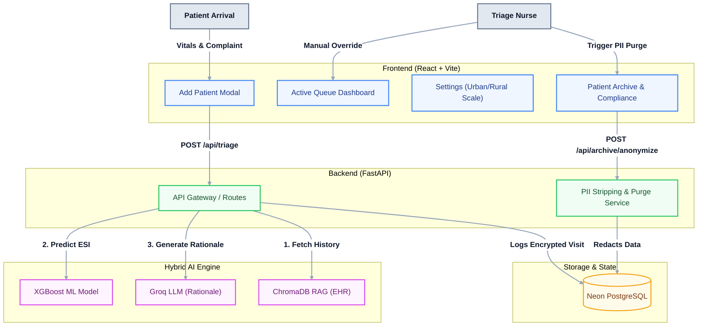

#  TriageFlow: PatientTriage.ai 

**TriageFlow** is a next-generation Emergency Department (ED) triage co-pilot designed to address the chaotic, high-stakes reality of modern ERs.

Emergency Departments face overlapping symptoms, incomplete patient histories, and massive variations in staffing scale. TriageFlow tackles these issues head-on by augmenting clinical judgment with a **Hybrid AI Architecture** that explicitly surfaces uncertainty, defaults to safety, and seamlessly handles data gaps.

---

##  Addressing  Complexities

We designed TriageFlow specifically around the real-world constraints:

### 1. Asymmetric Costs & Safety-First Defaults
Missing a critical case is categorically worse than over-prioritizing a minor one. TriageFlow is deliberately biased toward **escalation under uncertainty**. If a patient has borderline vitals, missing EHR history, or ambiguous symptoms, the AI conservatively assigns a higher Emergency Severity Index (ESI) score and explicitly lowers its **Confidence Percentage** to alert the nurse.

### 2. Ambiguous Symptoms & Demographic Variability
A fever of 38.5°C means something entirely different for a 3-year-old versus a 75-year-old. Instead of a rigid, adult-only scoring matrix, our hybrid engine passes age, sex, and vitals context into the LLM, allowing it to interpret tabular data dynamically based on pediatric or geriatric thresholds.

### 3. Inconsistent Data Availability
The system gracefully handles zero-history walk-ins. When a patient arrives, the ChromaDB Vector RAG searches for prior Electronic Health Records (EHR). If none exist, the system continues uninterrupted, scoring purely on observed vitals and complaints, but explicitly reflecting the "missing history" in its uncertainty score.

### 4. Wait-Time Deterioration & Surge Simulation
Patients are not static after triage. TriageFlow includes an active **Queue Monitoring System**. We built a "Fast-Forward Time" surge simulator that demonstrates what happens during a 3x volume surge: as wait times exceed safe clinical thresholds for specific ESI levels, the dashboard automatically flags patients with a red **"Needs Reassessment"** alert.

### 5. Facility Scalability (Urban vs. Rural)
Workflows for a 500-bed urban trauma center break down in a 50-bed rural clinic. TriageFlow includes a **Facility Settings Toggle**, allowing the engine to adjust triage routing based on local constraints (e.g., if the CT scanner is offline, certain stroke or trauma protocols are flagged for immediate transfer rather than internal waiting).

---

##  System Architecture

Our solution uses a decoupled, hybrid architecture to ensure sub-second response times for fatigued nurses.



---

##  Minimum Expectations Fulfilled

We built a working prototype populated with a realistic, simulated patient dataset

1. **20+ Simulated Records:** The application comes pre-loaded with diverse cases ranging from ESI 1 (Immediate) to ESI 5 (Non-urgent).
2. **Edge-Case Presentations:** 
   - **Ambiguous:** Patients presenting with vague "chest pressure" or under-reported pain.
   - **Pediatric/Geriatric:** 7-year-olds with high fevers and 80-year-olds with minor falls to demonstrate age-weighted LLM logic.
   - **Zero-History:** Walk-ins with no EHR data, proving the system functions on observed vitals alone.
3. **Surge Simulation:** A "Fast-Forward Time" slider on the dashboard simulates an ED surge, triggering dynamic reassessment warnings as wait times stretch.
4. **Explicit Uncertainty:** The UI never returns a naked score. Every ESI prediction is paired with a clear **AI Confidence %** and a clinical rationale explaining *why* the score was given.
5. **Clinician Override & Audit:** Nurses can click the override button on any patient. This immediately updates the queue and logs the decision (Nurse ID, Original Score, New Score, Timestamp) to a secure PostgreSQL database.

---

##  Data Strategy & Regulatory Jurisdiction

**Assumed Jurisdiction:** HIPAA (United States ER context)
* **Protection & Purge:** TriageFlow features a built-in PII Anonymizer. When patient records reach the end of their operational lifespan, the system irreversibly strips Personally Identifiable Information (Names, MRNs) before the data is archived for ML training. 
* **Audit Trail:** Clinician overrides are treated as legal medical records. The override action is captured immutably in a relational database (Neon Postgres) to protect the hospital against liability claims.

---

##  Future Scope
To evolve TriageFlow from an ED co-pilot into a comprehensive hospital operating system, our technical roadmap focuses on interoperability, multimodal data, and agentic workflows:

1. **Multi-Modal Vision Triage Augmentation**
   Expanding the inference engine beyond tabular and text data by integrating edge-based computer vision. Intake cameras could process visual distress indicators (e.g., detecting cyanosis, calculating burn surface area, or recognizing facial asymmetry for FAST stroke protocols) and pass these image vectors directly into the hybrid AI evaluation.

2. **Agentic ED Diversion & Load Balancing**
   EDs are often overwhelmed by low-acuity cases (ESI 4 and 5). We plan to introduce agentic workflows that autonomously identify stable, non-emergent patients and safely offer them immediate API-booked appointments at affiliated urgent care centers, diverting traffic and instantly alleviating ED bottlenecks.

3. **Zero-Click Clinical Pathway Activation**
   Moving beyond prediction to action. If the hybrid model detects a high statistical probability of a time-critical emergency (e.g., Sepsis, STEMI, or Acute Ischemic Stroke), TriageFlow will securely interface with the hospital paging system to mobilize specialized intervention teams before the patient even reaches a bed.

4. **Privacy-Preserving Federated Learning**
   To continuously improve the XGBoost and LLM rationale models without exposing Protected Health Information (PHI), we aim to deploy a Federated Learning architecture. TriageFlow instances across different hospital networks will train locally and only share encrypted weight updates with a central server, ensuring a highly generalized, unbiased model with zero HIPAA risk.

5. **Enterprise HL7 / FHIR Bi-Directional Interoperability**
   To seamlessly deploy into enterprise environments, the system must speak native healthcare protocols. The next infrastructure step is full bi-directional integration using HL7v2 and FHIR standards, allowing TriageFlow to instantly read from and write triage notes directly back to massive legacy EHRs like Epic and Cerner.

---

##  Quick Start (Development)
**Backend (FastAPI):**
```bash
python -m venv venv
venv\Scripts\activate
pip install -r backend/requirements.txt
uvicorn backend.app.main:app --reload --port 8000
```

**Frontend (React/Vite):**
```bash
cd frontend
npm install
npm run dev
```
