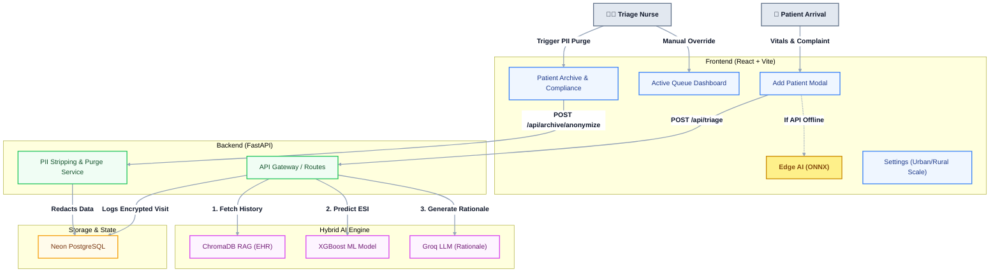

# TriageFlow Architectural Diagram (Simplified)

This is the clean, simplified horizontal layout of the architecture, now including the **Edge AI (ONNX)** fallback.

```mermaid
%%{init: {'theme': 'default', 'themeVariables': { 'edgeLabelBackground':'#ffffff', 'textColor': '#000000'}}}%%
flowchart TD
    %% Global Link Style
    linkStyle default stroke:#94a3b8,stroke-width:2px,color:#0f172a,font-weight:bold;

    %% Styling
    classDef user fill:#e2e8f0,stroke:#64748b,stroke-width:2px,color:#0f172a,font-weight:bold
    classDef frontend fill:#eff6ff,stroke:#3b82f6,stroke-width:2px,color:#1e3a8a
    classDef backend fill:#f0fdf4,stroke:#22c55e,stroke-width:2px,color:#14532d
    classDef ai fill:#fdf4ff,stroke:#d946ef,stroke-width:2px,color:#701a75
    classDef storage fill:#fffbeb,stroke:#f59e0b,stroke-width:2px,color:#78350f
    classDef edge fill:#fef08a,stroke:#ca8a04,stroke-width:2px,color:#854d0e,font-weight:bold

    %% Users (Top Level)
    Patient["🤒 Patient Arrival"]:::user
    Nurse["👩‍⚕️ Triage Nurse"]:::user

    %% Frontend Layer
    subgraph Frontend ["Frontend (React + Vite)"]
        Intake["Add Patient Modal"]:::frontend
        EdgeAI["Edge AI (ONNX)"]:::edge
        Dashboard["Active Queue Dashboard"]:::frontend
        Settings["Settings (Urban/Rural Scale)"]:::frontend
        Archive["Patient Archive & Compliance"]:::frontend
    end

    %% Backend Layer
    subgraph Backend ["Backend (FastAPI)"]
        API["API Gateway / Routes"]:::backend
        Anonymizer["PII Stripping & Purge Service"]:::backend
    end

    %% AI Layer
    subgraph AIEngine ["Hybrid AI Engine"]
        RAG["ChromaDB RAG (EHR)"]:::ai
        XGBoost["XGBoost ML Model"]:::ai
        LLM["Groq LLM (Rationale)"]:::ai
    end

    %% Storage Layer
    subgraph Storage ["Storage & State"]
        Neon["Neon PostgreSQL"]:::storage
    end

    %% Top-Level Interactions
    Patient -->|Vitals & Complaint| Intake
    Nurse -->|Manual Override| Dashboard
    Nurse -->|Trigger PII Purge| Archive

    %% Frontend to Backend
    Intake -->|POST /api/triage| API
    Intake -.->|If API Offline| EdgeAI
    
    %% API to AI
    API -->|1. Fetch History| RAG
    API -->|2. Predict ESI| XGBoost
    API -->|3. Generate Rationale| LLM
    
    %% API to Storage
    API -->|Logs Encrypted Visit| Neon
    
    %% Archive to Backend to Storage
    Archive -->|POST /api/archive/anonymize| Anonymizer
    Anonymizer -->|Redacts Data| Neon
```
